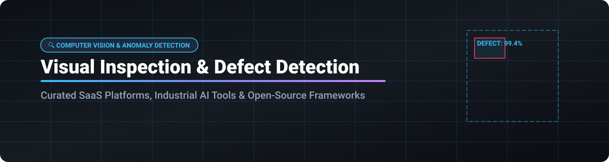

# Awesome-Computer-Vision-Visual-Inspection-Defect-Detection

# Awesome-Computer-Vision-Visual-Inspection-Defect-Detection 🔍 🏭



  





  
  
  
  
  
  



---

## 🌟 Top Computer Vision Visual Inspection & Defect Detection Ecosystem

**Curated List of Commercial Inspection Platforms & Open-Source Anomaly Detection Libraries**  
*Focused on Industrial Quality Control, Surface Defect Detection, Anomaly Detection, Few-Shot Learning, Edge Deployment & Self-Hosted Inspection Pipelines*

**Last updated: October 2026** 📅

---

### 📌 Overview & SEO Summary
Welcome to the ultimate curated directory of **visual inspection and defect detection platforms**, **open-source anomaly detection libraries**, and **industrial computer vision frameworks**. Whether you are looking for enterprise-grade commercial solutions (such as *Amazon Lookout for Vision*, *Landing AI LandingLens*, and *Cognex Deep Learning*), or self-hostable open-source alternatives (like *Anomalib*, *PatchCore*, and *PaDiM*), this list covers category leaders, few-shot learning, and privacy-respecting quality control.

**Key Market Context:**
- **Amazon Lookout for Vision reached End of Support on October 31, 2025** — existing customers must migrate to alternative anomaly detection solutions .
- **Anomalib (Intel)** is the **leading open-source anomaly detection library**, with **20+ algorithms**, **benchmarking on MVTec AD**, and **OpenVINO optimization for edge deployment** .
- **Visual anomaly detection is shifting to few-shot and zero-shot learning** — modern methods like **WinCLIP** and **AnomalyCLIP** require **no defect examples** for training.

---

## 📑 Table of Contents
- [🏢 SaaS & Commercial Platforms](#-saas--commercial-platforms)
- [🔓 Open-Source GitHub Projects](#-open-source-github-projects)
- [🛠️ How to Contribute](#%EF%B8%8F-how-to-contribute)
- [📊 Star History](#-star-history)
- [🤝 Support & Sponsorship](#-support--sponsorship)
- [⚠️ Disclaimer](#%EF%B8%8F-disclaimer)

---

## 🏢 SaaS / Commercial Platforms

The visual inspection market spans **hyperscaler vision services** (Amazon Lookout for Vision, Google Vertex AI Vision, Azure Computer Vision) that provide **pre-trained anomaly detection APIs**, **specialized industrial platforms** (Cognex, Landing AI, Instrumental) that offer **end-to-end inspection solutions with hardware integration**, and **manufacturing analytics platforms** (Sight Machine, Scortex, Elementary Robotics) that focus on **production quality and process optimization**. **Amazon Lookout for Vision** charged **$4.00/hour for training** and **$0.004 per image for inference** before End of Support . **Landing AI LandingLens** uses **custom enterprise pricing** with **free trial available** . **Cognex Deep Learning** requires **custom enterprise pricing** with **hardware bundles** .

| SaaS / Commercial Platform | Company / Owner | Valuation / Market Cap | Standard Edition Starting Price | Free Tier / Free Trial Limits | Description |
| :--- | :--- | :--- | :--- | :--- | :--- |
| **[Amazon Lookout for Vision](https://aws.amazon.com/lookout-for-vision/)** ⚠️ | Amazon | ~$2.0 Trillion | **End of Support: October 31, 2025**  | **Service discontinued**  | **AWS-native anomaly detection (discontinued)** — **No new customers**. **Training: $4.00/hour**; **Inference: $0.004/image** . **Existing customers must migrate** to alternative solutions . |
| **[Landing AI LandingLens](https://landing.ai/)** 🛬 | Landing AI | Private | **Custom enterprise pricing**  | **Free trial available**  | **Visual inspection platform** — **Data-centric AI approach** with small datasets . **Defect detection for manufacturing** . **No-code model training** . **Founded by Andrew Ng** . **Deployed at Foxconn, Solaredge, and other manufacturers** . |
| **[Cognex Deep Learning](https://www.cognex.com/)** 🔴 | Cognex | ~$10 Billion | **Custom enterprise pricing** (hardware + software)  | **Demo available**  | **Industrial machine vision** — **Deep learning-based defect detection** . **In-Sight ViDi** for factory automation . **Hardware and software integrated** . **The gold standard for industrial vision** . |
| **[Instrumental](https://instrumental.com/)** 🔬 | Instrumental | Private | **Custom enterprise pricing**  | **Demo available**  | **AI-powered visual inspection** — **Electronics manufacturing focus** . **Cloud-based defect detection** . **Used by major electronics manufacturers** . |
| **[Elementary Robotics](https://elementaryrobotics.com/)** 🤖 | Elementary Robotics | Private | **Custom enterprise pricing**  | **Demo available**  | **AI-powered quality inspection** — **Robotic inspection systems** . **End-to-end solution** with hardware and software . |
| **[Google Cloud Vertex AI Vision](https://cloud.google.com/vertex-ai-vision)** 🌐 | Google (Alphabet) | ~$2.0 Trillion | **$0.05–$0.15 per hour** (stream processing)  | **$300 free credits** for new customers  | **GCP-native vision AI** — **Pre-trained models for object detection and classification** . **Custom model training** with Vertex AI . **Video stream processing** . |
| **[Azure Computer Vision](https://azure.microsoft.com/en-us/products/ai-services/ai-vision)** 🔷 | Microsoft | ~$3.90 Trillion | **$1.00/1,000 transactions**  | **Free tier: 5,000 transactions/month**  | **Azure-native vision API** — **Image analysis, OCR, and spatial analysis** . **Custom Vision** for custom image classification . **Anomaly detection** via Azure Cognitive Services . |
| **[Sight Machine](https://sightmachine.com/)** 📊 | Sight Machine | Private | **Custom enterprise pricing**  | **Demo available**  | **Manufacturing data platform** — **AI-powered quality and process optimization** . **Real-time production analytics** . |
| **[Scortex](https://scortex.io/)** 🔬 | Scortex | Private | **Custom enterprise pricing**  | **Demo available**  | **AI-powered quality inspection** — **Deep learning for defect detection** . **Edge deployment** for factory floor . |
| **[Pleora Technologies](https://www.pleora.com/)** 📡 | Pleora Technologies | Private | **Custom enterprise pricing**  | **Demo available**  | **Industrial vision connectivity** — **GigE Vision and USB3 Vision** . **AI-powered inspection** with **eBUS** and **AI Gateway** . |

---

## 🔓 Open-Source GitHub Projects

*Sorted by GitHub_Stars_Count (Descending)* 🌟

- **[Anomalib (Intel)](https://github.com/openvinotoolkit/anomalib)**   
  **The leading open-source anomaly detection library**, Apache-2.0 licensed. **20+ state-of-the-art algorithms** including **PatchCore, PaDiM, STFPM, FastFlow, DRAEM, and Reverse Distillation** . **Benchmarking on MVTec AD, Visa, and BTAD datasets** . **OpenVINO optimization** for **edge deployment** — export models to OpenVINO IR for **Intel CPU/GPU/VPU acceleration** . **PyTorch Lightning** for training and evaluation . **TorchMetrics** for comprehensive evaluation metrics (AUROC, F1, PRO) . **The most complete open-source anomaly detection framework** — used by Intel for industrial inspection . 🏭

- **[PatchCore](https://github.com/amazon-science/patchcore-inspection)**   
  **Towards Total Recall in Industrial Anomaly Detection**, Apache-2.0 licensed. **The most widely used memory-based anomaly detection method** — **CVPR 2022 paper implementation** . **No defect examples required** — trained only on normal images . **State-of-the-art performance on MVTec AD** with **99.1% AUROC** . **The foundation for most industrial anomaly detection systems** . 🎯

- **[PaDiM](https://github.com/defeated/PaDiM-Anomaly-Detection-Localization-master)**   
  **PaDiM: a Patch Distribution Modeling Framework for Anomaly Detection**, open-source. **Efficient anomaly detection and localization** — **pre-trained CNN features + multivariate Gaussian** . **No training required** — just fit the distribution . **Fast inference** — **suitable for real-time inspection** . **The most accessible anomaly detection algorithm** . 📊

- **[FAIR 1.0 (Meta)](https://github.com/facebookresearch/faiss)**   
  **Facebook AI Similarity Search**, MIT licensed. **The foundational library for efficient similarity search** — **used by PatchCore and other memory-based anomaly detectors** . **Billion-scale nearest neighbor search** . **The backbone for industrial anomaly detection** . 🔍

- **[OpenVINO Toolkit](https://github.com/openvinotoolkit/openvino)**   
  **Intel's toolkit for optimizing and deploying AI inference**, Apache-2.0 licensed. **Accelerates anomaly detection models on Intel hardware** . **CPU, GPU, VPU, and FPGA support** . **The deployment backbone for Anomalib** . ⚡

- **[MVTec AD Dataset](https://www.mvtec.com/company/research/datasets/mvtec-ad)**   
  **The standard benchmark for unsupervised anomaly detection**, open for research. **5,354 images across 15 categories** (bottle, cable, capsule, carpet, grid, hazelnut, leather, metal_nut, pill, screw, tile, toothbrush, transistor, wood, zipper) . **The ImageNet of industrial anomaly detection** — every paper benchmarks on it . 🏆

- **[VisA Dataset](https://github.com/amazon-science/spot-diff)**   
  **Visual Anomaly and Novelty Detection dataset**, Apache-2.0 licensed. **12,000+ images across 12 subsets** . **Complex objects with multiple instances** . **The most challenging anomaly detection benchmark** . 🔬

- **[Deep Learning for Defect Detection (GitHub Topic)](https://github.com/topics/defect-detection)**   
  **Community-curated defect detection projects**, open-source. **Hundreds of repositories** for surface defect detection, PCB inspection, textile defect detection, and more . **The starting point for domain-specific inspection projects** . 🗂️

- **[Padim (Official Implementation)](https://github.com/xiahaifeng1995/PaDiM-Anomaly-Detection-Localization-master)**   
  **PaDiM official implementation**, open-source. **Patch distribution modeling for anomaly detection and localization** . **Efficient and effective** — no training required . **Used in industrial inspection pipelines** . 📐

---

## 🛠️ How to Contribute

Contributions are welcome! Follow these steps to submit new visual inspection platforms or open-source defect detection software:

1. 🍴 **Fork** the repository.
2. 📝 **Add/edit** entries in `README.md` maintaining table/list structure and formatting.
3. 🔗 Include project title, official website/GitHub link, exact Stars_Count, license, and brief description.
4. 🚀 Submit a **Pull Request** with a descriptive summary of your changes.

---

## 📊 Star History



---

## 🤝 Support & Sponsorship

If you find this visual inspection and defect detection repository useful, please consider supporting the project:

- ⭐ **Star** this repository to increase visibility!
- 🔀 **Fork** and share with fellow quality engineers, manufacturing AI practitioners, and open-source advocates.
- ☕ **Sponsor & Buy Me a Coffee**: Support ongoing open-source curation via the [GitHub Sponsor Dashboard](https://github.com/sponsors/ishandutta2007).

---

## ⚠️ Disclaimer

- This is a **community-curated** list — not exhaustive and not an endorsement. ℹ️
- **Amazon Lookout for Vision reached End of Support on October 31, 2025** — existing customers must migrate to alternative anomaly detection solutions . **AWS recommends Amazon Rekognition or SageMaker** for replacement .
- **Anomalib is the leading open-source anomaly detection library** — **20+ algorithms**, **MVTec AD benchmarking**, and **OpenVINO optimization for edge deployment** . **PatchCore achieves 99.1% AUROC on MVTec AD** .
- **Open-source visual inspection tools (Anomalib, PatchCore, PaDiM) are not turnkey** — they require **labeled normal images for training**, **GPU resources for training**, and **integration with camera/lighting hardware** . **Always validate model accuracy on your specific defect types** before production deployment . 🔍

---



  <b>Made with ❤️ for quality engineers, manufacturing AI practitioners, and open-source inspection advocates.</b>

